# Smoobu Integration - Multi-Stage Refactoring Plan

This is a large refactoring effort organized into **5 sequential stages**, each with its own focused plan document. The stages build on each other and should be executed in order.---

## Stage 1: Smoobu API Key Integration (Backoffice Setup)

**Goal:** Enable brokers to connect their Smoobu account before managing properties.

### Schema Changes

Add new table in [`src/db/schema.ts`](src/db/schema.ts):

```typescript
export const pmcIntegrations = sqliteTable("pmc_integrations", {
  id: text("id").primaryKey(),
  brokerId: text("broker_id").notNull().references(() => brokers.id),
  provider: text("provider").notNull(),
  apiKey: text("api_key").notNull(),
  createdAt: text("created_at").default(sql`CURRENT_TIMESTAMP`),
  updatedAt: text("updated_at").default(sql`CURRENT_TIMESTAMP`),
});
```


### UI Changes

make sure the changes you make to the code are organized in modules with clear separation of conerns and following the existing code patterns.

- make login.smoobu.com a top level constant in src/constants.ts
- DO NOT DELETE SMOOBU_API_KEY
- Modify [`BackofficeRoot.tsx`](src/modules/property/routes/BackofficeRoot.tsx) to check for active PMC integration
- Create `SmoobuSetupCard` component with:
- API key input field with helper text
- Client-side call to `GET https://login.smoobu.com/api/me`
- Display user confirmation (firstName, lastName, email)
- On confirm: POST to worker endpoint to store integration
- Write error handling in case of error (always using react-query)
- Disable property/experience quadrants until integration complete

### API Endpoints

- `POST /api/backoffice/integrations` - Store Smoobu API key
- `GET /api/backoffice/integrations` - Check integration status

---

## Stage 2: Hotels Schema + Property Form Refactor

**Goal:** Create dedicated hotels table matching Smoobu structure; refactor property creation to require Smoobu property selection.

### Schema Changes

update assets table in [`src/db/schema.ts`](src/db/schema.ts) - fields from assets need to include the Smoobu `/api/apartments/{id}` response

```typescript
export const assets = sqliteTable("assets", {
  id: text("id").primaryKey(),
  pmcAssetId: integer("smoobu_property_id").notNull().unique(),

  brokerId: text("broker_id")
    .notNull()
    .references(() => brokers.id),

  tier: text("tier")
    .$type<"elite" | "standard">()
    .notNull()
    .default("standard"),
  title: text("title").notNull(),
  description: text("description"),
  shortDescription: text("short_description"), // For cards

  
  // Location (from Smoobu)
  street: text("street"),
  zip: text("zip"),
  city: text("city"),
  country: text("country"),
  latitude: text("latitude"),
  longitude: text("longitude"),
  
  // Rooms (from Smoobu)
  maxOccupancy: integer("max_occupancy"),
  bedrooms: integer("bedrooms"),
  bathrooms: integer("bathrooms"),
  doubleBeds: integer("double_beds"),
  singleBeds: integer("single_beds"),
  sofaBeds: integer("sofa_beds"),
  couches: integer("couches"),
  childBeds: integer("child_beds"),
  queenSizeBeds: integer("queen_size_beds"),
  kingSizeBeds: integer("king_size_beds"),
  sqMeters: integer("sq_meters"),

  
  amenities: text("amenities", { mode: "json" }).$type<string[]>(),
  views: text("views", { mode: "json" }).$type<string[]>(),

  highlights: text("highlights", { mode: "json" }).$type<string[]>(),

  // Media
  videoUrl: text("video_url"), // For Elite tier video backgrounds
  pdfAssetPath: text("pdf_asset_path"), // Static PDF path e.g. /flyers/property-name.pdf
instantBook: integer("instant_book", { mode: "boolean" })
    .notNull()
    .default(false),

  createdAt: text("created_at").default(sql`CURRENT_TIMESTAMP`),
  updatedAt: text("updated_at").default(sql`CURRENT_TIMESTAMP`),
});
```

### Form Changes

Refactor [`CreatePropertyForm.tsx`](src/modules/property/ui/CreatePropertyForm.tsx):

1. **Step 1 (NEW):** Smoobu Property Selector

- Client calls `GET https://login.smoobu.com/api/apartments` using stored API key
- Display dropdown/list of available properties
- On select, fetch details via `GET /api/apartments/{id}`
- Pre-populate form with Smoobu data

2. **Steps 2+:** Existing form sections (with pre-filled values from Smoobu)
3. Remove pricing fields (basePrice, cleaningFee, minNights, maxNights) from property form - handled by Smoobu
4. Do not remove property title, descriptions.
5. Make sure you pre-fill the amenities section only, but leave signature highlights and panoramic views.
6. Leave Property images as is.

---

## Stage 3: Client-Side Smoobu Calendar/Pricing Fetch

**Goal:** Property detail pages fetch availability and pricing directly from Smoobu.

### New React Components

Create `src/modules/smoobu/`:

- `SmoobuCalendarFetcher.tsx` - React island for property pages
- `useSmoobuRates.ts` - Hook calling `GET /api/rates?apartments[]={id}&start_date=...&end_date=...`
- `useSmoobuAvailability.ts` - Hook for availability display
- `SmoobuPriceDisplay.tsx` - Shows live Smoobu pricing

### Integration Points

- [`elite/index.astro`](src/pages/elite/index.astro) property cards - fetch prices via Smoobu
- Property detail pages - calendar with Smoobu availability
- Booking widget uses Smoobu `checkApartmentAvailability` for price quotes

### Remove/Deprecate

- Current `pricingRules` table usage for hotels (keep for experiences)
- Current `availabilities` table for hotels
- [`/api/prices.ts`](src/pages/api/prices.ts) for hotel pricing (redirect to Smoobu flow)
- Kill all the pricing custom logic + view.

---

## Stage 4: Booking Flow with Smoobu

**Goal:** Server-side booking validation + Smoobu reservation creation.

### Booking Flow

```javascript
User selects dates -> Client calls Smoobu checkAssetAvailability
                   -> Display price from Smoobu
                   -> User confirms -> Stripe Checkout
                   -> Webhook confirms payment
                   -> Worker calls Smoobu POST /api/reservations
                   -> Log result to new table
```


### Schema Changes

Extend [`bookings`](src/db/schema.ts) table:

```typescript
// Add to existing bookings table
pmcReservationId: integer("pmc_reservation_id"),
checkInDate: text("check_in_date"), // YYYY-MM-DD
checkOutDate: text("check_out_date"),
```

Add new logging table:

```typescript
export const brokerLogs = sqliteTable("broker_logs", {
  id: text("id").primaryKey(),
  brokerId: text("broker_id").notNull().references(() => brokers.id),
  eventType: text("event_type").notNull(),
  relatedEntityId: text("related_entity_id"), // booking id, etc.
  message: text("message").notNull(),
  metadata: text("metadata", { mode: "json" }).$type<Record<string, unknown>>(),
  acknowledged: integer("acknowledged", { mode: "boolean" }).default(false),
  createdAt: text("created_at").default(sql`CURRENT_TIMESTAMP`),
});
```


### API Changes

Refactor [`bookingHandler.ts`](src/modules/booking/api/bookingHandler.ts):

1. Receive booking request with Smoobu property ID
2. Server calls Smoobu `checkApartmentAvailability` (don't trust client price)
3. Create Stripe Checkout Session with Smoobu price
4. On payment success webhook: Call Smoobu `POST /api/reservations`
5. Log success/failure to `brokerLogs`

### UI: Broker Notification Panel

- Display last 10 logs for broker in backoffice
- Show unacknowledged failures prominently
- Manual acknowledge button

---

## Stage 5: Experience Pricing Migration

**Goal:** Preserve current pricing system for experiences only.

### Changes

- Get rid of pricing rules nothing will use it.
- experiences price for now is JUST ONE no complex logic.
- Update/Delete [`/api/prices.ts`](src/pages/api/prices.ts):
- For `experienceIds` -> use static price
- For `assetIds` (hotels) -> redirect to Smoobu or return error
- Update experience booking handler to static price
---

## Architecture Diagram

```mermaid
flowchart TB
    subgraph backoffice [Backoffice Flow]
        API_KEY[Enter Smoobu API Key]
        VERIFY[Verify via /api/me]
        SELECT[Select Smoobu Property]
        FORM[Fill Additional Details]
        SAVE[Save to hotels + assets]
        API_KEY --> VERIFY --> SELECT --> FORM --> SAVE
    end
    
    subgraph client [Client Property View]
        PAGE[Property Page]
        RATES[Fetch Smoobu /api/rates]
        AVAIL[checkApartmentAvailability]
        PAGE --> RATES
        PAGE --> AVAIL
    end
    
    subgraph booking [Booking Flow]
        REQ[Booking Request]
        SERVER_CHECK[Server: checkApartmentAvailability]
        STRIPE[Stripe Checkout]
        WEBHOOK[Payment Webhook]
        SMOOBU_BOOK[POST /api/reservations]
        LOG[Log to brokerLogs]
        REQ --> SERVER_CHECK --> STRIPE --> WEBHOOK --> SMOOBU_BOOK --> LOG
    end
```



---

## Unresolved Questions

1. **API Key Storage:** Store in D1 encrypted or use Cloudflare secrets for broker keys?
- Just store in d1 as is for now (no encryption)
2. **Smoobu Channel ID:** What `channelId` to use when creating bookings? (Need to check Smoobu settings for "direct" channel)
ChannelMarkups, channels, pricingRules tables can be destroyed 
3. **Currency Handling:** Smoobu returns currency per property - handle EUR/USD/GBP conversion or assume single currency? 
- No do not any any conversion always show the price as is. in fact, you can kill preferred currency from the schema. Only allow the currencies available from smoobu api data.
4. **Rate Limiting:** Smoobu has rate limits - cache calendar data in KV or fetch real-time?
Let's fetch real time for now, but add a note so I don't forget


